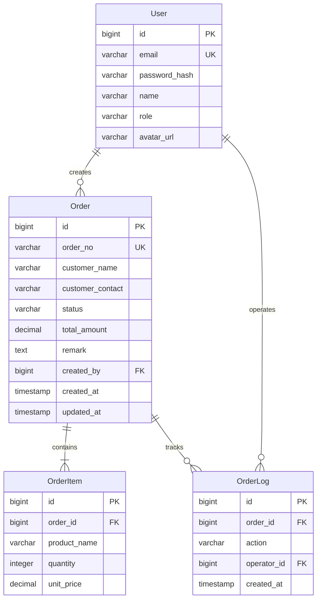
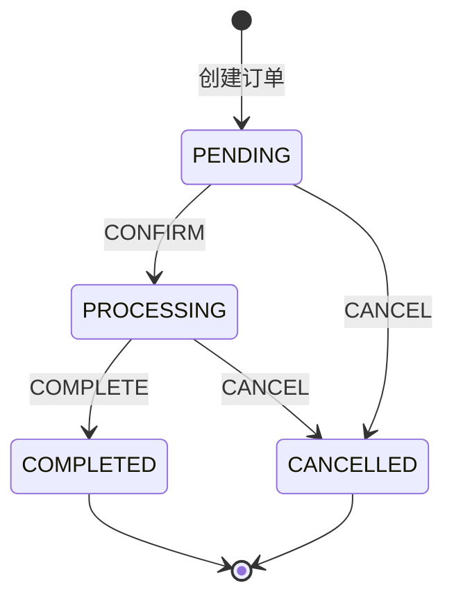
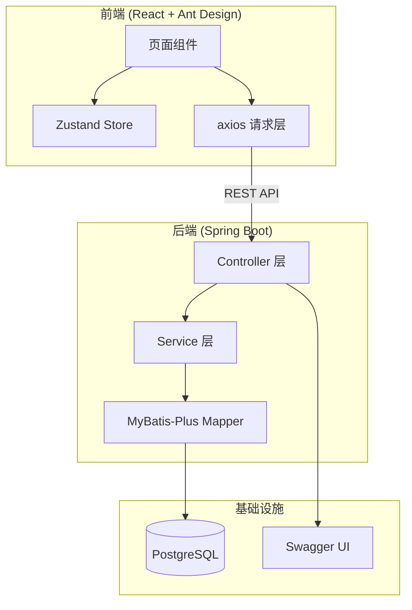
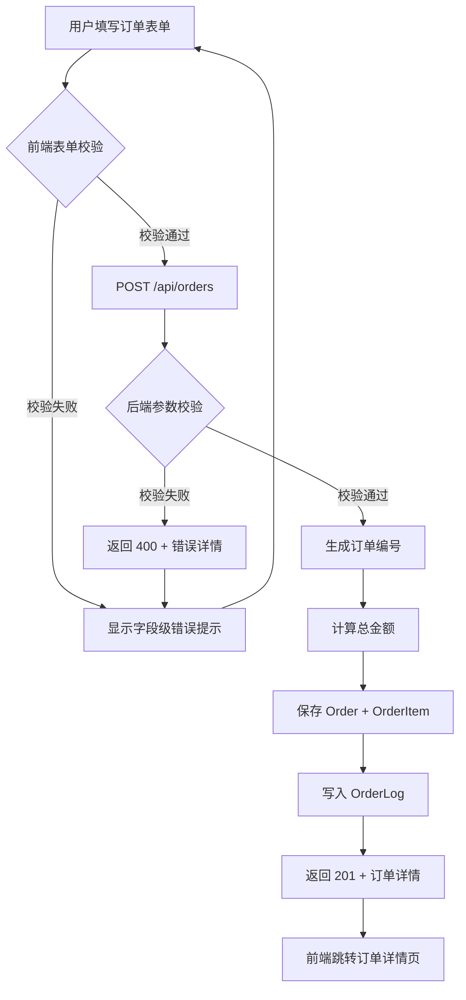
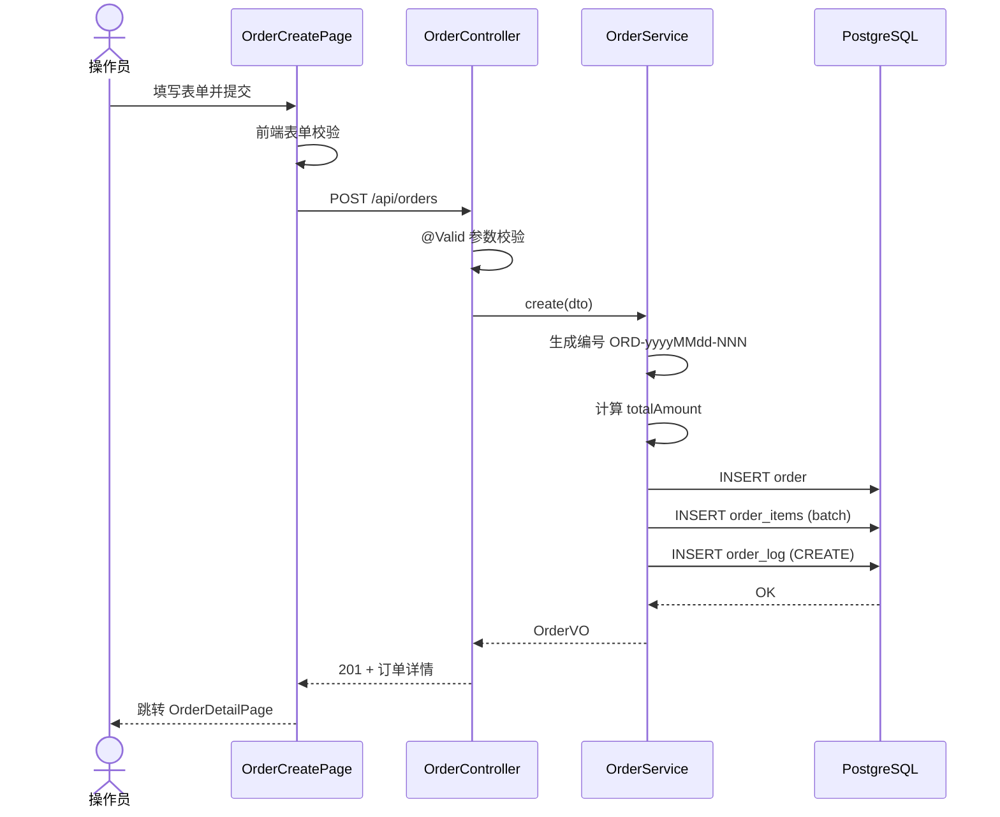
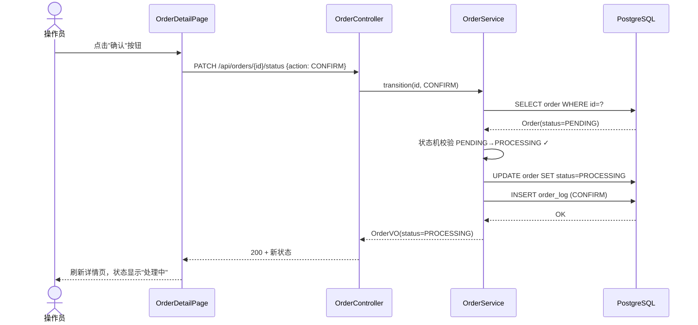

# 程序设计文档

## 1. 技术栈回顾

- 开发范围：全栈
- 前端：React 18 + TypeScript + Ant Design 5 + Zustand + Vite
- 后端：Java 21 + Spring Boot 3.2 + MyBatis-Plus + PostgreSQL 16
- 认证：JWT（Spring Security）
- API 文档：SpringDoc OpenAPI

## 2. UI 设计规范

### 配色

| 用途 | 色值 | 说明 |
|------|------|------|
| 主色 | #2563eb | 按钮、链接、激活态 |
| 辅助色 | #16a34a | 成功/完成状态 |
| 警告色 | #eab308 | 待处理/提醒 |
| 错误色 | #dc2626 | 错误/已取消 |
| 背景色 | #f5f5f5 | 页面底色 |
| 文字色 | #1f2937 | 正文文字 |

暗色模式：不支持（后续迭代考虑）

### 字体与排版

| 项 | 值 |
|----|----|
| 主字体 | -apple-system, system-ui, sans-serif |
| 正文字号 | 14px |
| 标题字号 | H1: 24px / H2: 20px / H3: 16px |
| 行高 | 1.6 |

### 间距与圆角

| 项 | 值 |
|----|----|
| 基础间距单位 | 8px |
| 卡片圆角 | 8px |
| 按钮圆角 | 6px |

### 响应式断点

| 名称 | 宽度 | 布局变化 |
|------|------|----------|
| 桌面 | >=1200px | 侧边栏展开 |
| 窄屏 | <1200px | 侧边栏折叠（本期仅桌面） |

## 3. 模块与分层

### 前端

- **页面/路由**：

| 路由 | 页面组件 | 说明 |
|------|----------|------|
| /login | LoginPage | 登录页 |
| / | DashboardPage | 统计概览 |
| /orders | OrderListPage | 订单列表 |
| /orders/new | OrderCreatePage | 新建订单 |
| /orders/:id | OrderDetailPage | 订单详情 |
| /users | UserManagePage | 用户管理（管理员） |
| /profile | ProfilePage | 个人资料 |

- **通用组件**：基于 Ant Design — Table、Form、Modal、Button、Tag
- **业务组件**：OrderStatusTag（状态标签）、StatsCard（统计卡片）
- **Layout 组件**：AppLayout（ProLayout — 侧边栏 + 顶栏 + 内容区）
- **状态管理**：Zustand — `useAuthStore`（用户/token）、`useOrderStore`（列表缓存）
- **请求层**：`api/client.ts` — axios 实例，拦截 401 跳登录，统一错误提示

### 后端

- **API 层**：Controller — 请求接收、参数校验（@Valid）、响应封装
- **业务层**：Service — 业务逻辑、状态机校验、权限检查
- **数据层**：Mapper（MyBatis-Plus）— 自动 CRUD + 自定义 SQL
- **日志**：SLF4J + Logback，JSON 格式，INFO 级别；关键操作（登录/订单变更）记 WARN
- **API 文档**：SpringDoc — `/swagger-ui.html`，按 Controller 分组

### 数据模型

| 实体 | 字段 | 类型 | 约束 | 说明 |
|------|------|------|------|------|
| User | id | bigint | PK, auto | |
| User | email | varchar(255) | UNIQUE, NOT NULL | |
| User | password_hash | varchar(255) | NOT NULL | bcrypt |
| User | name | varchar(100) | NOT NULL | |
| User | role | varchar(20) | NOT NULL | ADMIN/OPERATOR/VIEWER |
| User | avatar_url | varchar(500) | | 可为空 |
| Order | id | bigint | PK, auto | |
| Order | order_no | varchar(30) | UNIQUE, NOT NULL | 格式 ORD-yyyyMMdd-NNN |
| Order | customer_name | varchar(200) | NOT NULL | |
| Order | customer_contact | varchar(100) | | |
| Order | status | varchar(20) | NOT NULL, DEFAULT 'PENDING' | |
| Order | total_amount | decimal(12,2) | NOT NULL | |
| Order | remark | text | | |
| Order | created_by | bigint | FK → user.id | |
| Order | created_at | timestamp | NOT NULL, DEFAULT NOW() | |
| Order | updated_at | timestamp | NOT NULL | |
| OrderItem | id | bigint | PK, auto | |
| OrderItem | order_id | bigint | FK → order.id, ON DELETE CASCADE | |
| OrderItem | product_name | varchar(200) | NOT NULL | |
| OrderItem | quantity | integer | NOT NULL, CHECK >=1 | |
| OrderItem | unit_price | decimal(10,2) | NOT NULL, CHECK >=0 | |
| OrderLog | id | bigint | PK, auto | |
| OrderLog | order_id | bigint | FK → order.id | |
| OrderLog | action | varchar(50) | NOT NULL | |
| OrderLog | operator_id | bigint | FK → user.id | |
| OrderLog | created_at | timestamp | NOT NULL, DEFAULT NOW() | |

### ER 图（Mermaid）



## 4. API 设计（核心接口）

### POST /api/auth/login

- **请求体**：

```json
{
  "email": "string",
  "password": "string"
}
```

- **响应体**（200）：

```json
{
  "code": 0,
  "data": {
    "token": "string",
    "user": { "id": 1, "email": "...", "name": "...", "role": "OPERATOR" }
  }
}
```

- **错误**：400 参数无效 / 401 凭证错误

### POST /api/orders

- **请求体**：见技术评审 API 契约

- **响应体**（201）：见技术评审 API 契约

- **权限**：ADMIN / OPERATOR

### PATCH /api/orders/{id}/status

- **请求体**：`{ "action": "CONFIRM" }`
- **状态机**：



## 5. 架构总览图（Mermaid）



## 6. 关键流程

### 流程一：订单创建

#### 流程图



#### 时序图



### 流程二：订单状态流转

#### 流程图

```mermaid
flowchart TD
    A[操作员点击状态操作按钮] --> B[PATCH /api/orders/id/status]
    B --> C{当前状态是否允许此操作?}
    C -->|不允许| D[返回 409 非法状态转换]
    D --> E[前端提示"操作冲突"]
    C -->|允许| F[更新 status + updated_at]
    F --> G[写入 OrderLog]
    G --> H[返回 200 + 新状态]
    H --> I[前端刷新详情页]
```

#### 时序图



## 7. 错误处理策略

### 后端

| 错误码 | 含义 | HTTP 状态码 |
|--------|------|:-----------:|
| 0 | 成功 | 200/201 |
| 40001 | 参数校验失败 | 400 |
| 40101 | 未认证 | 401 |
| 40301 | 权限不足 | 403 |
| 40401 | 资源不存在 | 404 |
| 40901 | 非法状态转换 | 409 |
| 50001 | 服务端异常 | 500 |

全局异常处理器 `@RestControllerAdvice` 统一捕获并封装。

### 前端

- 全局拦截（axios interceptor）：401 → 清空 token + 跳转 `/login`；500 → `message.error("服务异常")`
- 局部处理：表单校验错误 → Ant Design Form 字段级提示；409 → 提示"操作冲突，请刷新重试"

## 8. 工程目录结构

```
project-root/
├── frontend/
│   ├── src/
│   │   ├── api/                 # axios 实例 + 各模块 API 函数
│   │   │   ├── client.ts
│   │   │   ├── auth.ts
│   │   │   └── orders.ts
│   │   ├── components/          # 业务组件
│   │   │   ├── OrderStatusTag.tsx
│   │   │   └── StatsCard.tsx
│   │   ├── layouts/             # AppLayout
│   │   │   └── AppLayout.tsx
│   │   ├── pages/               # 页面组件
│   │   │   ├── LoginPage.tsx
│   │   │   ├── DashboardPage.tsx
│   │   │   ├── OrderListPage.tsx
│   │   │   ├── OrderCreatePage.tsx
│   │   │   ├── OrderDetailPage.tsx
│   │   │   ├── UserManagePage.tsx
│   │   │   └── ProfilePage.tsx
│   │   ├── stores/              # Zustand stores
│   │   │   └── authStore.ts
│   │   ├── types/               # TypeScript 类型
│   │   │   └── index.ts
│   │   ├── App.tsx
│   │   └── main.tsx
│   ├── package.json
│   └── vite.config.ts
├── backend/
│   └── src/main/java/com/example/projectx/
│       ├── controller/          # REST 控制器
│       │   ├── AuthController.java
│       │   ├── OrderController.java
│       │   └── UserController.java
│       ├── service/             # 业务逻辑
│       │   ├── AuthService.java
│       │   ├── OrderService.java
│       │   └── UserService.java
│       ├── mapper/              # MyBatis-Plus Mapper
│       │   ├── UserMapper.java
│       │   ├── OrderMapper.java
│       │   ├── OrderItemMapper.java
│       │   └── OrderLogMapper.java
│       ├── model/
│       │   ├── entity/          # 实体类
│       │   ├── dto/             # 请求/响应 DTO
│       │   └── enums/           # 枚举（角色、订单状态）
│       ├── config/              # 配置类（Security、Swagger、MyBatis）
│       ├── exception/           # 全局异常处理
│       └── util/                # 工具类（JWT、订单号生成）
├── docs/                        # 工作流产出文档
├── docker-compose.yml
└── Makefile
```
