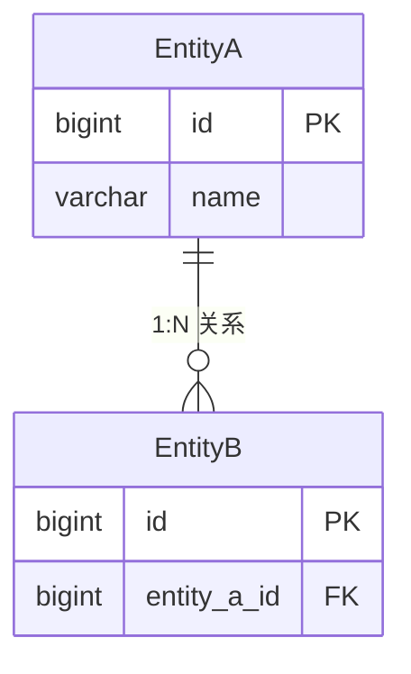
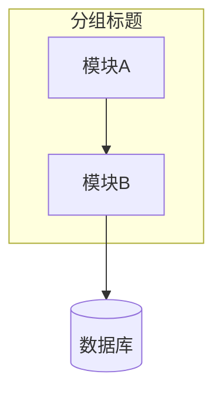
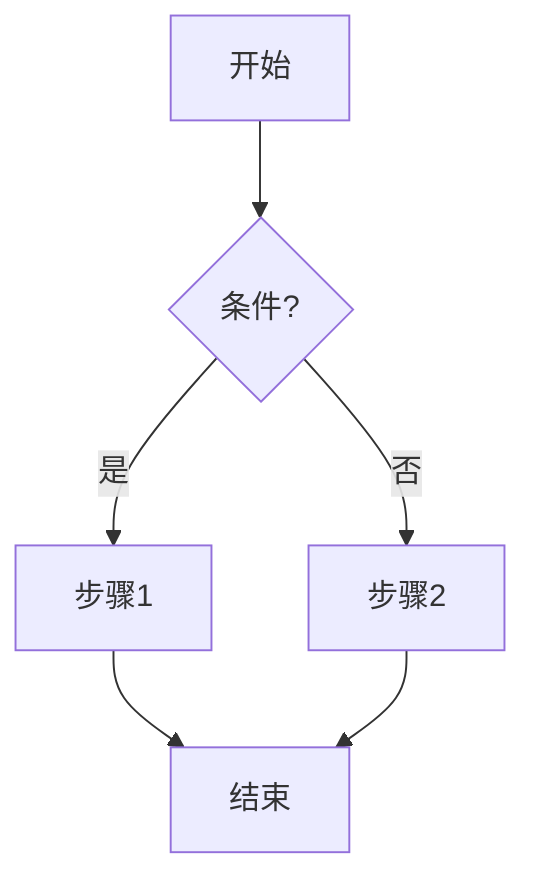
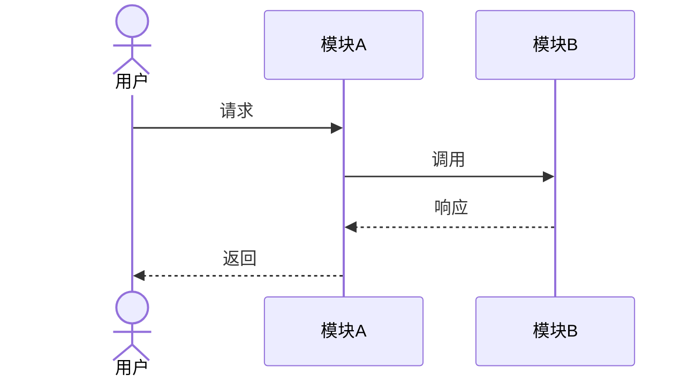
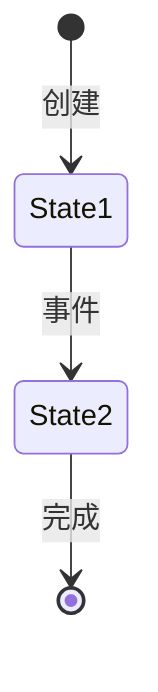

# 程序设计参考指南

## 分层架构参考

### 前端典型分层

```
src/
├── api/           # API 请求函数，按模块分文件
├── components/    # 可复用的业务组件
├── layouts/       # 页面布局组件（侧边栏、顶栏等）
├── pages/         # 页面组件，与路由一一对应
├── stores/        # 全局状态管理
├── hooks/         # 自定义 React/Vue hooks
├── types/         # TypeScript 类型定义
├── utils/         # 工具函数
└── styles/        # 全局样式、主题变量
```

### 后端典型分层（Spring Boot）

```
src/main/java/com/example/project/
├── controller/    # REST API 入口，只做参数校验和响应封装
├── service/       # 业务逻辑，事务管理
├── mapper/        # 数据库访问（MyBatis-Plus）
│   └── xml/       # 自定义 SQL（如果需要）
├── model/
│   ├── entity/    # 数据库实体（与表一一对应）
│   ├── dto/       # 请求/响应数据传输对象
│   └── enums/     # 枚举类
├── config/        # 配置类（Security、Swagger、CORS 等）
├── exception/     # 自定义异常 + 全局异常处理器
├── interceptor/   # 拦截器（日志、权限）
└── util/          # 工具类
```

### 后端典型分层（Express/Fastify）

```
src/
├── routes/        # 路由定义
├── controllers/   # 请求处理
├── services/      # 业务逻辑
├── models/        # 数据模型（Prisma/TypeORM schema）
├── middleware/     # 中间件（认证、错误处理、日志）
├── validators/    # 请求参数校验（Joi/Zod schema）
├── types/         # TypeScript 类型
├── config/        # 配置
└── utils/         # 工具函数
```

## 状态机设计

### 什么时候需要状态机

- 实体有多个状态且状态间转换有严格规则
- 非法状态转换需要阻止（如"已完成"不能再变为"处理中"）

### 简单枚举式状态机

```java
public enum OrderStatus {
    PENDING, PROCESSING, COMPLETED, CANCELLED;

    private static final Map<OrderStatus, Set<OrderStatus>> TRANSITIONS = Map.of(
        PENDING, Set.of(PROCESSING, CANCELLED),
        PROCESSING, Set.of(COMPLETED, CANCELLED)
    );

    public boolean canTransitionTo(OrderStatus target) {
        return TRANSITIONS.getOrDefault(this, Set.of()).contains(target);
    }
}
```

## API 设计模式

### 统一响应封装

```java
public class ApiResponse<T> {
    private int code;
    private String message;
    private T data;
}
```

### 分页请求/响应

```java
// 请求
public class PageRequest {
    private int page = 1;
    private int size = 20;
    private String sort;
}

// 响应
public class PageResult<T> {
    private List<T> items;
    private long total;
    private int page;
    private int size;
    private int pages;
}
```

### 筛选与搜索

```
GET /api/orders?status=PENDING&keyword=张三&page=1&size=20&sort=createdAt,desc
```

## 前端请求层封装模式

```typescript
// api/client.ts
const client = axios.create({ baseURL: '/api' });

client.interceptors.request.use(config => {
    const token = useAuthStore.getState().token;
    if (token) config.headers.Authorization = `Bearer ${token}`;
    return config;
});

client.interceptors.response.use(
    res => res.data,
    err => {
        if (err.response?.status === 401) {
            useAuthStore.getState().logout();
            window.location.href = '/login';
        }
        return Promise.reject(err);
    }
);
```

## 前端状态管理模式

```typescript
// stores/authStore.ts
interface AuthState {
    token: string | null;
    user: User | null;
    login: (email: string, password: string) => Promise<void>;
    logout: () => void;
}

const useAuthStore = create<AuthState>((set) => ({
    token: localStorage.getItem('token'),
    user: null,
    login: async (email, password) => {
        const { data } = await authApi.login({ email, password });
        localStorage.setItem('token', data.token);
        set({ token: data.token, user: data.user });
    },
    logout: () => {
        localStorage.removeItem('token');
        set({ token: null, user: null });
    },
}));
```

## 错误处理最佳实践

### 后端 — 全局异常处理器

```java
@RestControllerAdvice
public class GlobalExceptionHandler {
    @ExceptionHandler(MethodArgumentNotValidException.class)
    public ApiResponse<?> handleValidation(MethodArgumentNotValidException e) {
        // 提取字段级错误 → 40001
    }

    @ExceptionHandler(BusinessException.class)
    public ApiResponse<?> handleBusiness(BusinessException e) {
        // 业务异常 → 对应 code
    }

    @ExceptionHandler(Exception.class)
    public ApiResponse<?> handleUnknown(Exception e) {
        // 未知异常 → 50001，日志记录堆栈
    }
}
```

### 前端 — 错误边界

```typescript
// 全局：axios interceptor 处理 401、500
// 页面级：try-catch + message.error()
// 组件级：React ErrorBoundary 捕获渲染异常
```

## 数据库设计注意事项

1. **主键策略**：建议 bigint 自增或雪花算法，避免 UUID 作为聚簇索引
2. **时间字段**：统一使用 `timestamp with time zone`，存储 UTC
3. **软删除**：使用 `deleted_at` 字段而非物理删除
4. **索引**：高频查询字段（status、created_by、created_at）建议加索引
5. **枚举存储**：使用 varchar 存储枚举名，避免数字映射导致可读性差

## Mermaid 图表语法速查

程序设计文档要求使用 Mermaid 绘制以下 4 种图表。

### ER 图



关系符号：`||--||`（1:1）、`||--o{`（1:N）、`}o--o{`（N:N）

### 架构图（graph）



方向：`TB`（上→下）、`LR`（左→右）

### 流程图（flowchart）



节点形状：`[矩形]`、`{菱形}`、`([圆角])` 、`[(圆柱)]`

### 时序图（sequenceDiagram）



箭头：`->>` 实线请求、`-->>` 虚线响应、`-)` 异步消息

### 状态图（stateDiagram-v2）



适用于实体状态机（如订单状态流转）。
